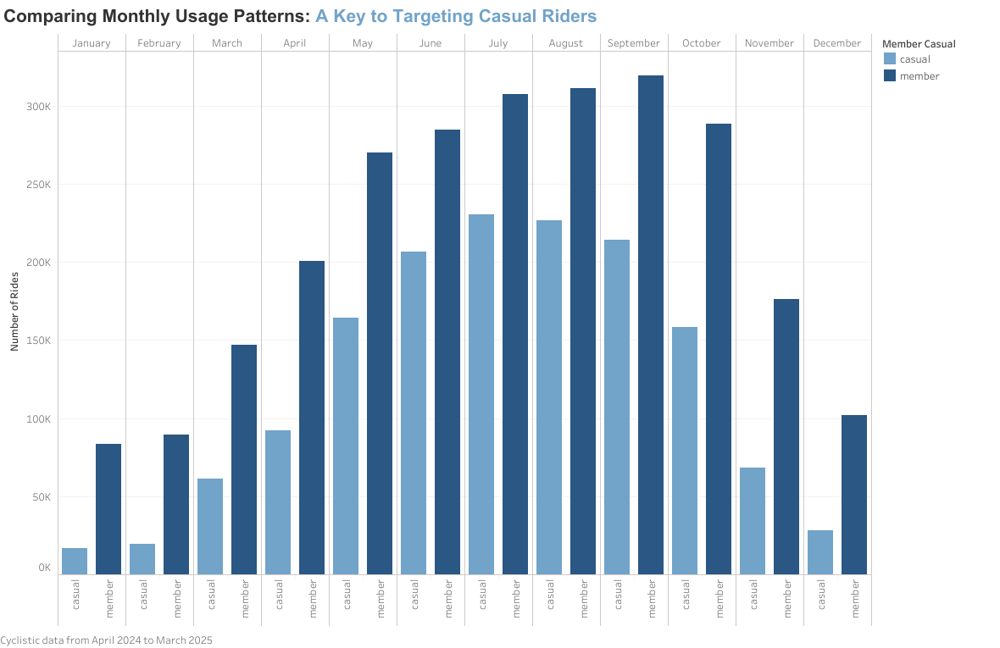
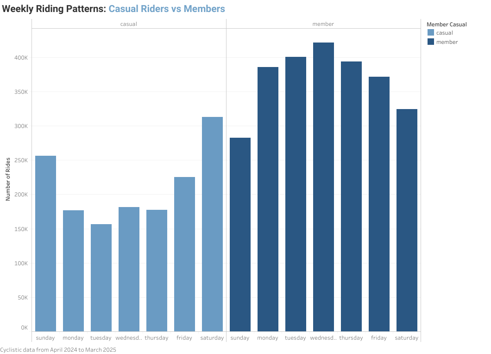
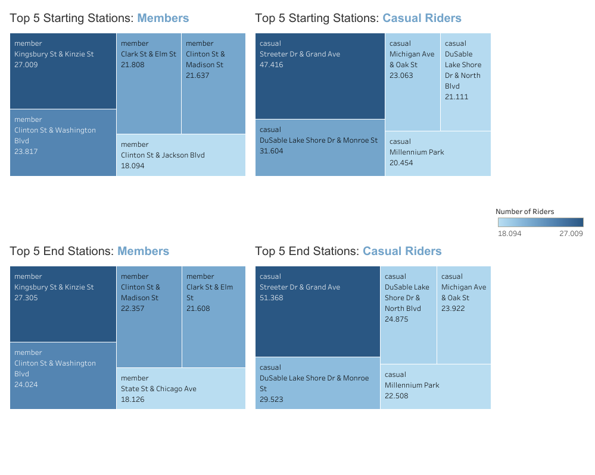

# Cyclistic Case Study Capstone

## Google Data Analytics - Case Study: How does a Bike-Share Navigate Speedy Success?

---

## 1. Introduction

Cyclistic is a bike-sharing company based in Chicago, offering flexible bike rental options through a vast network of docking stations. Riders can choose between casual pay-as-you-go plans and annual memberships.

As the company continues to grow, Cyclistic is exploring new strategies to increase customer retention and boost long-term revenue. One key area of interest is understanding how to encourage more casual riders to convert into annual members.

---

## 2. Scenario

The Cyclistic marketing team is conducting a detailed analysis of rider behavior. The goal is to uncover patterns and insights that can guide targeted marketing campaigns and inform business decisions aimed at expanding the member base.

By gaining insights from the data, this analysis aims to provide actionable recommendations to help convert more casual riders into loyal annual members.

---

## 3. Ask Phase

The business task:  
The Cyclistic marketing team wants to design strategies that encourage casual riders to become annual members.

To support this goal, the data analysis team has been asked to analyze historical bike trip data to identify key differences in usage patterns between casual riders and annual members. These insights will help inform marketing recommendations that are data-driven and tailored to user behavior.

---

## 4. Prepare Phase

**Where is the data located?**  
The data used in this analysis is publicly available and was downloaded from [Data Source](https://divvy-tripdata.s3.amazonaws.com/index.html).

**How is the data organized?**  
The data is organized into monthly CSV files.

**How are you addressing licensing?**  
The data license can be found on [License Information](https://www.divvybikes.com/data-license-agreement).

---

## 5. Process Phase

**Tool chosen and why:**  
I used **R** for data cleaning and transformation because of its strong capabilities for handling large datasets and performing efficient data manipulation — advantages not easily achievable in spreadsheet tools like Excel.  
Since **R** was a core tool taught during the Google Data Analytics course, it aligned perfectly with the project requirements.

**Loading and setting up the environment:**

```r
# Installing packages
install.packages("tidyverse")
install.packages("dplyr")
install.packages("lubridate")
```

```r
# Loading packages
library(tidyverse)
library(dplyr)
library(lubridate)
```

```r
# Setting working directory
setwd("C:/Users/alice/OneDrive/Documentos/Analise de dados Coursera + Google/MODULE 8/Case study 1/202404202503_Cyclistic")
```

```r
# Aggregating data
aggregate_files <- list.files(pattern = "*.csv")
aggregate_data <- map_df(aggregate_files, read_csv())
```

---

## 6. Data Cleaning Phase

After consolidating the data in the previous phase, I performed several
key cleaning steps:

- Created a new data frame and selected necessary columns for analysis.

``` r
cyclistic_clean_data <- aggregate_data %>% 
  select("ride_id", "rideable_type", "started_at", "ended_at",
         "start_station_name", "end_station_name", "member_casual") %>% 
```

- Removes all rows that contain missing values

``` r
na.omit() %>% 
```

- Calculates the duration of each ride in minutes and extracts the day
  of the week the ride started on

``` r
mutate(trip_length = as.numeric(difftime(ended_at, started_at, units = "mins")),
         weekday = format(as.Date(started_at), "%A")) %>% 
  select("ride_id", "rideable_type","started_at", "ended_at", "start_station_name",
  "end_station_name", "weekday", "trip_length", "member_casual") 
```

- Filters the dataset to include only rides with a trip length between 1
  minute and 1440 minutes

``` r
filter(trip_length >= 1, trip_length <= 1440)
```

- Checking duplicates

``` r
any(duplicated(cyclistic_clean_data$ride_id))
```

- How many duplicates

``` r
sum(duplicated(cyclistic_clean_data$ride_id))
```

- Remove duplicates

``` r
cyclistic_clean_data <- cyclistic_clean_data %>%
  distinct(ride_id, .keep_all = TRUE)
```

- Checking again (confirming duplicates were removed)

``` r
any(duplicated(cyclistic_clean_data$ride_id))
```

- Checking current unique values to confirm the data has just two riders
  type

``` r
unique(cyclistic_clean_data$member_casual)
```
---

## 7. Data Analysis Phase

With the data now cleaned, we can begin analyzing it to gain deeper
insights into user characteristics and behavioral patterns.

- Shortest trip duration

``` r
min(cyclistic_clean_data$trip_length)
```

- Longest trip duration

``` r
max(cyclistic_clean_data$trip_length)
```

- Comparing the number of rides per month

``` r
month_count = cyclistic_clean_data %>% 
  group_by(months = month.name[month(started_at)], member_casual) %>% 
  summarize(row_count = n()) %>% 
  arrange(match(months,month.name))
```

- Comparing the number of rides per days of the week

``` r
weekday_count = cyclistic_clean_data %>% 
  group_by(weekday = weekday, member_casual = member_casual) %>% 
  summarize(row_count = n())
```

- Top 5 starting locations

``` r
top_start_station <- cyclistic_clean_data %>% 
  filter(!is.na(start_station_name)) %>%
  group_by(member_casual, start_station_name) %>%
  summarize(row_count = n(), .groups = "drop") %>%
  group_by(member_casual) %>%
  slice_max(order_by = row_count, n = 5)
```

- Top 5 ending locations

``` r
top_end_station <- cyclistic_clean_data %>% 
  filter(!is.na(end_station_name)) %>%
  group_by(member_casual, end_station_name) %>%
  summarize(row_count = n(), .groups = "drop") %>%
  group_by(member_casual) %>%
  slice_max(order_by = row_count, n = 5)
```

- Comparing trip length

``` r
ride_length <- cyclistic_clean_data %>% 
  group_by(member_casual) %>% 
  summarize(mean(trip_length))
```
---

## 8. Share Phase

For visualization, I selected **Tableau**, another tool introduced in the course, to create interactive dashboards and effectively communicate key findings.
These visualizations reveal trends and patterns critical to understanding the differences between casual riders and annual members.
To showcase everything I’ve learned throughout this
journey, I also created a short PowerPoint presentation summarizing the
project, which can be found in this repository

### Comparing the Number of Rides per Month



**Insights:**
- Casual riders are highly seasonal, with ridership peaking during summer months.
- Ridership drops dramatically during the winter for casual riders.
- Annual members show more consistent year-round usage.
- Both groups experience increased bike usage during summer.


### Comparing the Number of Rides per Days of the Week



**Insights:**
- Casual rider usage peaks on weekends, especially Saturdays.
- Weekday usage is significantly lower for casual riders, suggesting a leisure/tourism pattern.
- Annual members ride most frequently on weekdays, with a peak on Wednesdays, reflecting commuting patterns.


### Top 5 Starting and Ending Stations


**Insights:**
- Both casual riders and annual members exhibit distinct top 5 stations.
- Starting and ending stations for each group are identical.
- Members favor stations near business districts and transit hubs.
- Casual riders prefer tourist-heavy and scenic locations.
  
---
  
## 9. Act Phase

It is time to act!

Based on the insights from all the visuals and analysis, here are the
top three strategic recommendations to enhance Cyclistic’s operations
and marketing efforts:

- 1: **Leverage seasonal peaks to target casual riders** - Launch seasonal
  promotions and campaigns during late spring and summer to convert
  casual riders into members.

- 2: **Develop weekend strategies** - Introduce partnerships with tourist
  attractions to appeal to casual riders and access to coupons at
  restaurants and events to enhance their experience.

- 3: **Optimize and enhance services around key hub stations** - Attract
  casual riders by transforming their favorite stations into marketing
  hotspots, add eye-catching materials, easy sign-up QR codes, and
  irresistible first-ride rewards.

## Final Remarks
Thank you for reviewing my project!
